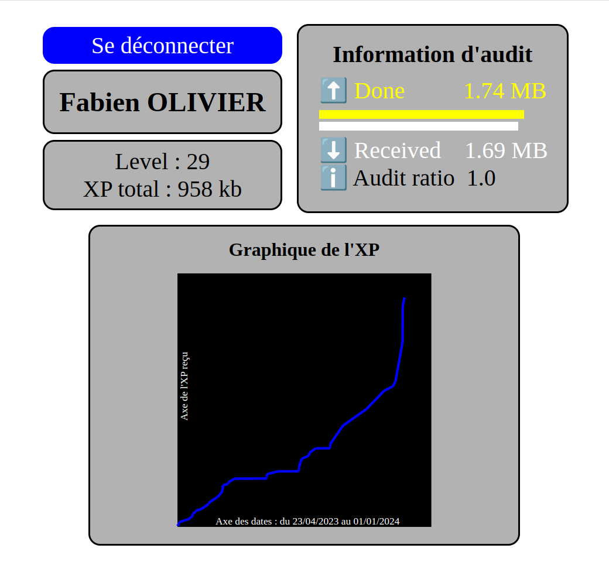

 # GraphQL

### Descriptif
_______
L'objectif de ce projet est d'apprendre le langage de requête GraphQL, en créant sa propre page de profil à partir du point de terminaison GraphQL fourni par la plateforme de la formation, pour nous permettre de réaliser le projet, l'école nous fournie la <a href="https://public.01-edu.org/docs/db/database-structure" target="blank">structure de l'API</a>. 
Pour accéder à mes données, j'ai créé une page de connexion puis une page de profils avec les données accessibles via mon compte.
Le projet demande la création de <a href="https://developer.mozilla.org/en-US/docs/Web/SVG" target="blank">graphique svg</a>.

### Image
_______

### Usage
_______
Page hébergé via <a href="https://pages.github.com" target="blank">GitHub Pages</a> 
Lien d'accées : <a href="https://f-olivier.github.io/GraphQL_Zone01/" target="blank">https://f-olivier.github.io/GraphQL_Zone01/</a>

### Dépendance
_______
Utilisation des languages/librairies suivantes : `JavaScript`, `HTML` et `CSS`

### Authors
_______
+ Fabien OLIVIER
